# 无人值守的Linux镜像 #
## 实验环境 ##
- Virtualbox
- Ubuntu 18.04 Server 64bit

## 实验步骤 ##
### 一、虚拟机网卡 ###
- 虚拟机配置如下
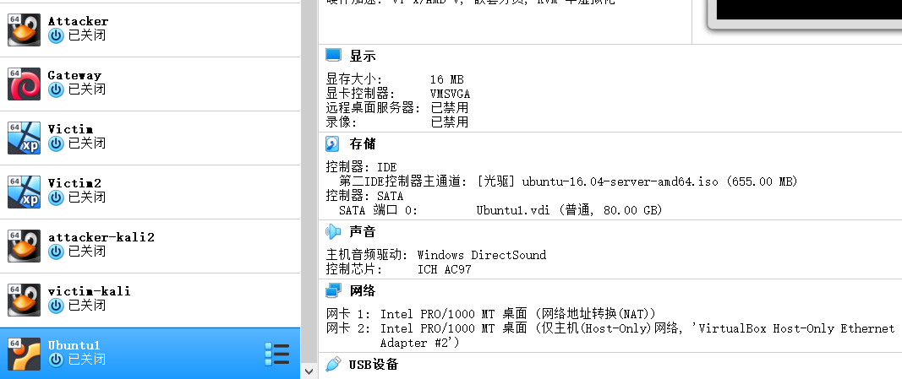

### 二、ios镜像生成 ###
- 在用户目录下输入：mkdir loopdir，创建一个用于挂载iso镜像文件的目录。
- 在虚拟机中下载原ubuntu-16.04.1-server-amd64.iso，输入：wget http://mirrors.ustc.edu.cn/ubuntu-cdimage/releases/18.04/release/ubuntu-18.04.4-server-amd64.iso
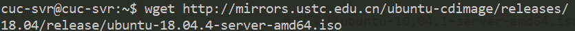
- 挂载镜像到loopdir目录中，输入sudo mount -o loop ubuntu-16.04.1-server-amd64.iso loopdir
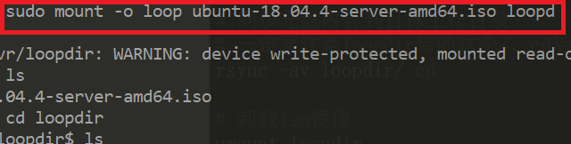
- 创建一个工作目录用于克隆光盘内容，同步光盘内容到目标工作目录，卸载iso镜像，此操作依次输入：mkdir cd，rsync -av loopdir/ cd，sudo umount loopdir
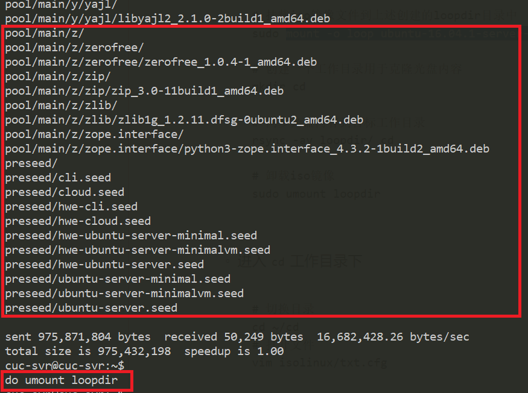
- 进入目标工作目录并打开文件vim isolinux/txt.cfg，在 isolinux/txt.cfg 文件开头中添加如下内容并保存
```
label autoinstall
menu label ^Auto Install Ubuntu Server
kernel /install/vmlinuz
append  file=/cdrom/preseed/ubuntu-server-autoinstall.seed debian-installer/locale=en_US console-setup/layoutcode=us keyboard-configuration/layoutcode=us console-setup/ask_detect=false localechooser/translation/warn-light=true localechooser/translation/warn-severe=true initrd=/install/initrd.gz root=/dev/ram rw quiet
```
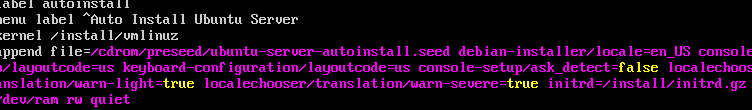
-将seed文件下载至本机，并且用scp命令拷贝到虚拟机中cd目录下的preseed文件夹中（需要先为目标路径设置写入权限，利用命令sudo chmod -R 775 ~/cd/preseed可修改权限）
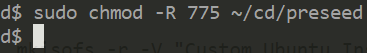
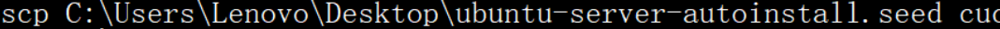

- 修改文件isolinux/isolinux.cfg,在文件末尾添加timeout 10
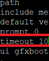
- 重新生成md5sum.txt（find . -type f -print0 | xargs -0 md5sum > md5sum.txt）
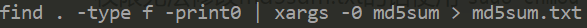
- 配置并生成shell脚本（shell前置包：sudo apt-get install genisoimage)
```
# 新建shell文件
sudo vim shell
# 添加以下内容到shell文件中
IMAGE=custom.iso
BUILD=~/cd/
mkisofs -r -V "Custom Ubuntu Install CD" \
          -cache-inodes \
          -J -l -b isolinux/isolinux.bin \
          -c isolinux/boot.cat -no-emul-boot \
          -boot-load-size 4 -boot-info-table \
          -o $IMAGE $BUILD
# 如果目标磁盘之前有数据，则在安装过程中会在分区检测环节出现人机交互对话框需要人工选择
# 执行shell命令
bash shell
```
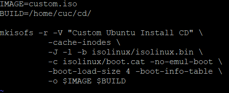
- 把生成的镜像custom.iso下载到宿主机上（get /home/cuc/custom.iso）。
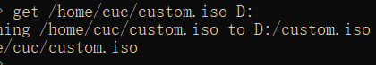

### 三、利用生成的镜像进行无人值守的Linux安装 ###
- 打开seed文件，可以看到ubuntu系统用户名为cuc，密码为sec.cuc.edu.cn
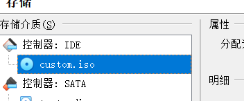
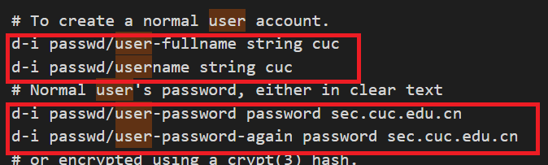

## 困难总结 ##
- 照着视频配置虚拟机时老师提到他的演示机未联网，为了防止系统安装失败所以安装语言选择了英语，我自己安装时因为联着网所以选择了中文，结果多次出错，最终改为了英文并跟着老师一步步走才得以解决。
- 进行宿主机与虚拟机文件拷贝时因路径出错和虚拟机用户名出错而导致镜像拷贝失败，上网查资料改正了路径并配置/etc/hosts文件更改主机名后得以解决（最后还是选择了用“ get http://mirrors.ustc.edu.cn/ubuntu-cdimage/releases/18.04/release/ubuntu-18.04.4-server-amd64.iso ” 直接下载）
- scp命令拷贝时因无权限导致失败，解决方法要么更改权限，要么先将宿主机文件（如seed文件）拷贝到虚拟机cuc目录，再转到所需目录（如preseed目录）。
- 需注意各步骤操作前置条件（是否有前置包等）。

## 参考资料 ##
- [SSH 与 Virtualbox](https://www.cnblogs.com/lxg0/p/6413965.html)

- [ubuntu虚拟机配置](https://www.bilibili.com/video/av86360030)

- [Linux 基础2](https://www.bilibili.com/video/av86360440)

- [Linux 基础3](https://www.bilibili.com/video/av86360664)