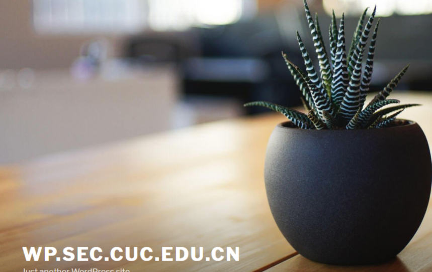

# Web服务器 #
## 实验环境 ##
- Nginx
- VeryNginx
- WordPress 4.7
- Damn Vulnerable Web Application (DVWA)

## 实验要求 ##
### 1.基本要求 ###
- 在一台主机（虚拟机）上同时配置Nginx和VeryNginx
 - VeryNginx作为本次实验的Web App的反向代理服务器和WAF
 - PHP-FPM进程的反向代理配置在nginx服务器上，VeryNginx服务器不直接配置Web站点服务
- 使用Wordpress搭建的站点对外提供访问的地址为：http://wp.sec.cuc.edu.cn
- 使用Damn Vulnerable Web Application (DVWA)搭建的站点对外提供访问的地址为：http://dvwa.sec.cuc.edu.cn

### 2.安全加固要求 ###
- 使用IP地址方式均无法访问上述任意站点，并向访客展示自定义的友好错误提示信息页面-1
- Damn Vulnerable Web Application (DVWA)只允许白名单上的访客来源IP，其他来源的IP访问均向访客展示自定义的友好错误提示信息页面-2
- 在不升级Wordpress版本的情况下，通过定制VeryNginx的访问控制策略规则，热修复WordPress < 4.7.1 - Username Enumeration
- 通过配置VeryNginx的Filter规则实现对Damn Vulnerable Web Application (DVWA)的SQL注入实验在低安全等级条件下进行防护

### 3.VeryNginx配置要求 ###
- VeryNginx的Web管理页面仅允许白名单上的访客来源IP，其他来源的IP访问均向访客展示自定义的友好错误提示信息页面-3
- 通过定制VeryNginx的访问控制策略规则实现：
 - 限制DVWA站点的单IP访问速率为每秒请求数 < 50
 - 限制Wordpress站点的单IP访问速率为每秒请求数 < 20
 - 超过访问频率限制的请求直接返回自定义错误提示信息页面-4
 - 禁止curl访问

## 实验过程 ##
- Nginx安装
```
sudo apt update                #下载nginx
sudo apt install nginx
cd /etc/nginx/sites-enabled    #修改端口号
sudo vim /etc/nginx/sites-enabled/default
apt-cache search libssl        #查看版本名称
```


- VeryNginx安装
```
git clone https://github.com/alexazhou/VeryNginx
cd VeryNginx
# 安装一系列的依赖库
sudo apt install gcc
sudo apt install libssl1.0-dev
sudo apt install libpcre3 libpcre3-dev
sudo apt install make
sudo apt-get install zlib1g-dev
sudo python install.py install
```

“出错了，重新安装依赖库”
```
sudo apt-get update
sudo apt-get install python3
sudo apt-get install libpcre3 libpcre3-dev libssl-dev build-essential
sudo apt-get install libssl1.0-dev
sudo apt-get install zlib1g-dev
# 重新再尝试安装
sudo python3 install.py install
```

“成功！”
- 修改端口号为88，防撞
- 修改user为www-data

- 启动、停止、重启服务
```
# 添加用户
adduser nginx
#启动服务
sudo /opt/verynginx/openresty/nginx/sbin/nginx
#停止服务
/opt/verynginx/openresty/nginx/sbin/nginx -s stop
#重启服务
/opt/verynginx/openresty/nginx/sbin/nginx -s reload
```
- 在主机访问http://192.168.56.108:88/和http://192.168.56.108:88/verynginx/index.html（用户名密码都是verynginx）


- WordPress 4.7安装
- 下载mysql、php和相关扩展
```
# 安装数据库
$ sudo apt install mysql-server
$ sudo mysql -u root -p	        #检查是否正常运行，默认下无密码
# 安装php和相关扩展
$ sudo apt install php-fpm php-mysql
$ sudo apt install php-curl php-gd php-intl php-mbstring php-soap php-xml php-xmlrpc php-zip
$ sudo systemctl restart php7.2-fpm
```

- 数据库支持
```
# mysql新建数据库
$ sudo mysql -u root -p
> CREATE DATABASE wordpress DEFAULT CHARACTER SET utf8 COLLATE utf8_unicode_ci;
> GRANT ALL ON wordpress.* TO 'wpuser'@'localhost' IDENTIFIED BY 'test';
> FLUSH PRIVILEGES;
> EXIT;
```

- 下载 wordpress
```
cd /tmp
# 下载实验指定版本安装包
sudo wget https://github.com/WordPress/WordPress/archive/4.7.zip
# 解压
sudo apt install unzip
unzip -o 4.7.zip
sudo mv WordPress-4.7 wordpress
```
- 建立Apache与MySQL的连接
```
sudo apt-get install phpmyadmin -y    #会涉及配置选项，在虚拟机中做，直接按回车
sudo ln -s /usr/share/phpmyadmin /var/www/html/phpmyadmin
sudo service mysql restart
sudo systemctl restart apache2.service
sudo /etc/init.d/apache2 status
```

- 配置WordPress数据库
```
sudo mysql -u root -p
CREATE DATABASE wpress;	#创建数据库
CREATE USER wordpressusers;	#创建管理员
SET PASSWORD FOR wordpressusers = PASSWORD("1234");	#设置密码
GRANT ALL PRIVILEGES ON wpress.* TO wordpressusers IDENTIFIED BY "1234";	#设置权限
FLUSH PRIVILEGES;	#生效配置
exit
```

- 访问 http://wp.sec.cuc.edu.cn

- DVWA安装
```
cd /tmp
git clone https://github.com/ethicalhack3r/DVWA
sudo cp -r /tmp/DVWA /var/www/html
```
- 新建数据库
```
sudo mysql -u root -p
> CREATE DATABASE dvwa DEFAULT CHARACTER SET utf8mb4 COLLATE utf8mb4_unicode_ci;
> GRANT ALL ON dvwa.* TO 'dvwauser'@'localhost' IDENTIFIED BY 'test';
> FLUSH PRIVILEGES;
> EXIT;
sudo systemctl restart mysql
```

- 修改dvwa数据库相关和其他设置
```
cd /var/www/html/DVWA      #
sudo cp config/config.inc.php.dist config/config.inc.php
sudo vim /var/www/html/DVWA/config/config.inc.php         
        # 修改以下内容
        $_DVWA[ 'db_database' ] = 'dvwa';
        $_DVWA[ 'db_user' ]     = 'dvwauser';
        $_DVWA[ 'db_password' ] = 'test';
# 修改文件属主
sudo chown -R www-data:www-data /var/www/html/dvwa
# 修改 nginx 相关配置
sudo vim /etc/nginx/conf.d/default.conf
        server {
                listen 5566;
                server_name  dvwa.sec.cuc.edu.cn;
                root /var/www/html/dvwa;
                index index.html index.htm index.php index.nginx-debian.html;
                location / {
                        try_files $uri $uri/ = 404;
                        }
                location ~ \.php$ {
                        include snippets/fastcgi-php.conf;
                        fastcgi_pass unix:/var/run/php/php7.2-fpm.sock;
                        }
                        }
# 修改php相关设置
sudo vim  /etc/php/7.2/fpm/php.ini
        # 修改以下内容
        allow_url_include = On
sudo systemctl restart php7.2-fpm	#重启php，使配置生效
sudo systemctl restart nginx	#重启nginx，使配置生效
```
- 访问dvwa.sec.cuc.edu.cn:5566

- 设置VeryNginx,修改nginx的配置文件
```
sudo vim /etc/nginx/sites-enabled/default
```

- 通过 VeryNginx进行相关设置

- 安全加固（修改 Matcher、Response、Filter）
 - 使用IP地址方式均无法访问上述任意站点，并向访客展示自定义的友好错误提示信息页面-1
 matcher设置使host符合IP地址的正则表达式
 response设置回应
 设置filter，action是block，选择设置的回答

 - Damn Vulnerable Web Application (DVWA)只允许白名单上的访客来源IP，其他来源的IP访问均向访客展示自定义的友好错误提示信息页面-2
 matcher设置使host符合DVWA的域名，IP不等于白名单
 其他两项同上


 - 通过配置VeryNginx的Filter规则实现对Damn Vulnerable Web Application (DVWA)的SQL注入实验在低安全等级条件下进行防护
 matcher设置sql注入会用到的select语句、or、where
 其他两项同上


- VeryNginx配置要求
 - VeryNginx的Web管理页面仅允许白名单上的访客来源IP，其他来源的IP访问均向访客展示自定义的友好错误提示信息页面
 matcher设置限制DVWA站点的单IP

 - 通过定制VeryNginx的访问控制策略规则实现：
   - 访问速率为每秒请求数 < 50
   - 限制Wordpress站点的单IP访问速率为每秒请求数 < 20
   - 超过访问频率限制的请求直接返回自定义错误提示信息页面-4
   前两项修改Frequency Limit即可，第三项修改Response，步骤类似前面

## 实验总结 ##
- 无法反问openresty等网页，排除问题后发现主机无法ping通虚拟机。解决方法：方法一，重设host-only网卡（详情见实验一）；方法二，在主机网络配置里进行网卡桥接。
- 反思:实验期间端口号混乱且刚开始未注意要避开同一端口，询问同学后得知需更改设置不同端口，解决后实验得以继续进行。

## 参考资料 ##
- [WordPress4.7](https://github.com/WordPress/WordPress/releases/tag/4.7)
- [创建数据库错误](https://blog.csdn.net/you23hai45/article/details/48497613)
- [Apache2](https://www.linuxidc.com/Linux/2018-11/155507.htm)